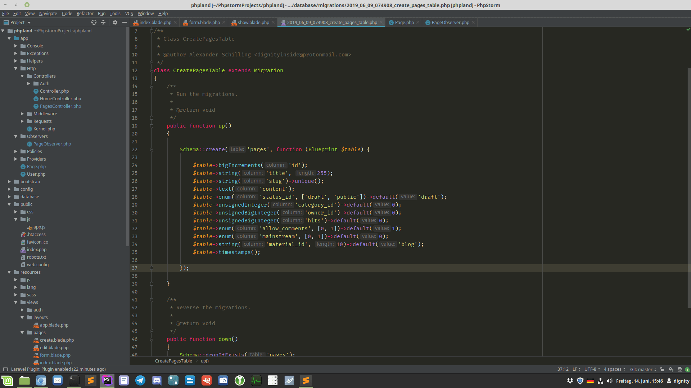

## subldark

Sublime Text Dark like color scheme for PHPStorm and other JetBrains IDEs.

## Installation

1. Clone repository or download `subldark.icls` file
2. File → Settings → Editor → Color Scheme
3. Click on the gear icon
4. Import Scheme...
5. Select `subldark.icls`

### Optional settings

- File → Settings → Editor → Font: Fira Code, 15, 1.2
- Disable View → Toolbar
- Disable View → Tool window Bars
- Disable View → Navigation Bar

## Contributing

1. Fork it
2. Create your feature branch (git checkout -b my-new-feature)
3. Make your changes
4. Commit your changes (git commit -am 'Added some feature')
5. Push to the branch (git push origin my-new-feature)
6. Create new Pull Request

## License

Licensed under the [MIT license](https://opensource.org/licenses/MIT).
